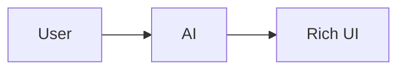

# AI Formatting Guide — making the AI emit rich content

The frontend **already renders rich content** from any assistant markdown — no code changes
needed. A response is plain markdown; when it contains a **rich block**, that block renders as a
component (chart, table, callout, …). The only thing required is that **your AI/backend emits the
block conventions below**.

This guide is for the **backend / prompt** side (e.g. the Flask server or the LLM system prompt).
For exact payload schemas see [STANDARDS.md](STANDARDS.md).

---

## How rendering works (why no frontend change is needed)

Both the live streaming path and the sample path run through the **same** markdown pipeline
(`Message.tsx → MarkdownRenderer → RichBlock → registry`). So if a streamed Flask response contains
a ```` ```chart ```` fence or a `:::callout` directive, it renders as the rich component
automatically. Incomplete blocks mid-stream show a subtle "Rendering…" placeholder and resolve when
the closing fence arrives.

---

## The rules (put these in your system prompt)

1. **Reply in normal markdown.** Use rich blocks only when they genuinely help (data → chart/table,
   process → steps/timeline, aside → callout). Otherwise plain markdown is perfect.
2. **Emit a rich block as a fenced code block** whose language is the block type, containing **one
   valid JSON object** (except `mermaid`, whose body is Mermaid DSL):
   <pre>
   ```chart
   { ...single JSON object... }
   ```
   </pre>
3. **One JSON object per block. Valid JSON only** — double-quoted keys/strings, no trailing commas,
   no comments. If unsure, fall back to a normal markdown table or prose.
4. **Never wrap a block in extra prose inside the fence.** Prose goes *around* the block, not inside.
5. **Prefer fenced blocks** over the `:::type` directive form (both work; fenced is more reliable).
6. **Do not emit raw HTML** — it is not rendered.

---

## System-prompt snippet (copy-paste, trim to taste)

```text
When a structured format communicates better than prose, embed a "rich block": a fenced code block
whose info-string is the block type and whose body is a single valid JSON object. Supported types:
chart, table, timeline, mermaid, infographic, progress, callout, accordion, steps, codegroup, cards,
badges, template.

Rules:
- Output normal markdown; add rich blocks only when they help.
- Exactly one JSON object per block; strictly valid JSON (double quotes, no trailing commas, no comments).
- mermaid blocks contain Mermaid diagram source, not JSON.
- Put explanatory text outside the block, never inside the fence.
- Never output raw HTML.

Examples:
- Numeric trends/series -> ```chart
- Row/column data -> ```table  (or a normal markdown table for small/simple data)
- Chronology/roadmap -> ```timeline
- Flow/sequence/gantt -> ```mermaid
- KPI headline numbers -> ```infographic
- Completion/utilization -> ```progress
- Important aside -> ```callout {variant: note|tip|warning|danger}
- FAQ/expandable -> ```accordion
- Ordered how-to -> ```steps
- Multi-language install/code -> ```codegroup
- Set of items/options -> ```cards
- Tags/status pills -> ```badges
- Quiz/tabbed widget -> ```template
```

---

## One compact example per type

Charts:
<pre>
```chart
{ "type": "line", "title": "Revenue ($K)", "xKey": "month",
  "series": [{ "key": "revenue", "label": "Revenue" }],
  "data": [{ "month": "Jan", "revenue": 120 }, { "month": "Feb", "revenue": 168 }] }
```
</pre>

Table:
<pre>
```table
{ "title": "Issues", "sortable": true,
  "columns": [{ "key": "who", "label": "Assignee" }, { "key": "open", "label": "Open", "align": "right" }],
  "rows": [{ "who": "Ami", "open": 12 }, { "who": "Bo", "open": 7 }] }
```
</pre>

Timeline:
<pre>
```timeline
{ "events": [ { "date": "Q1", "title": "Discovery", "status": "done" },
              { "date": "Q2", "title": "Prototype", "status": "active" } ] }
```
</pre>

Mermaid (DSL, not JSON):
<pre>

</pre>

Infographic:
<pre>
```infographic
{ "stats": [ { "icon": "💰", "label": "Revenue", "value": "$312", "unit": "K", "delta": "+15%", "trend": "up" } ] }
```
</pre>

Progress:
<pre>
```progress
{ "title": "Delivery", "items": [ { "label": "Docs", "value": 60 } ] }
```
</pre>

Callout:
<pre>
```callout
{ "variant": "tip", "title": "Tip", "body": "Short, useful aside." }
```
</pre>

Accordion:
<pre>
```accordion
{ "items": [ { "title": "Q?", "body": "A." } ] }
```
</pre>

Steps:
<pre>
```steps
{ "steps": [ { "title": "Install", "body": "npm install" }, { "title": "Run", "body": "npm run dev" } ] }
```
</pre>

Code group:
<pre>
```codegroup
{ "tabs": [ { "label": "npm", "language": "bash", "code": "npm install x" },
            { "label": "pnpm", "language": "bash", "code": "pnpm add x" } ] }
```
</pre>

Cards:
<pre>
```cards
{ "columns": 3, "cards": [ { "title": "Charts", "badge": "Recharts", "description": "Line, bar, pie" } ] }
```
</pre>

Badges:
<pre>
```badges
{ "badges": [ { "label": "Stable", "variant": "default" }, { "label": "Beta", "variant": "secondary" } ] }
```
</pre>

Template (quiz / tabs):
<pre>
```template
{ "kind": "quiz", "question": "2 + 2 = ?", "options": ["3", "4"], "answerIndex": 1 }
```
</pre>

---

## Testing without the AI

In the app, use the composer's **Insert example** menu to render any of these blocks instantly. It
appends an assistant message using the exact same render path a live AI response uses — the fastest
way to confirm a format renders before wiring it into your backend prompts.

## Graceful degradation

- Unknown block type → the raw body is shown with a notice (won't crash).
- Malformed JSON → shown as raw with a "Could not parse" notice; **mid-stream** it shows a
  "Rendering…" placeholder until the block completes.
- A renderer error is caught by an error boundary; the rest of the message still renders.

So it is always safe to experiment — a bad block degrades locally instead of breaking the reply.
