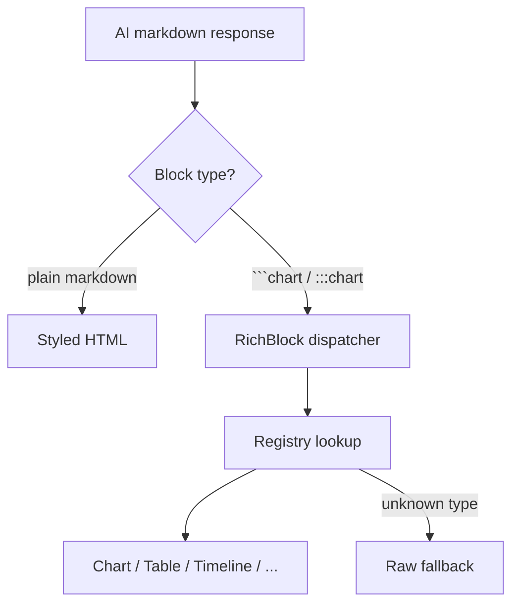
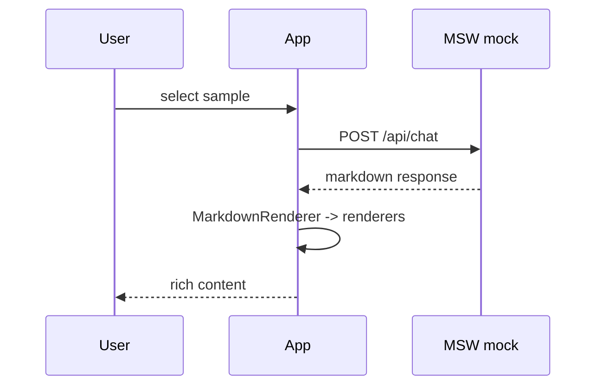

# How Rendering Works

The flow below shows how an AI markdown response becomes rich UI:

```mermaid
graph TD
    A[AI markdown response] --> B{Block type?}
    B -->|plain markdown| C[Styled HTML]
    B -->|```chart / :::chart| D[RichBlock dispatcher]
    D --> E[Registry lookup]
    E --> F[Chart / Table / Timeline / ...]
    E -->|unknown type| G[Raw fallback]
```

And here's the request sequence when a user opens a sample:

```mermaid
sequenceDiagram
    participant U as User
    participant App
    participant MSW as MSW mock
    U->>App: select sample
    App->>MSW: POST /api/chat
    MSW-->>App: markdown response
    App->>App: MarkdownRenderer -> renderers
    App-->>U: rich content
```
