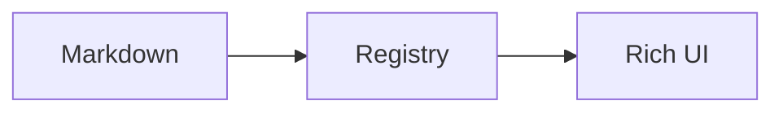

# Everything, One Response

This single "AI response" exercises **every renderer** and shows that the two
block syntaxes are interchangeable.

```callout
{ "variant": "tip", "title": "One response, many renderers", "body": "Everything below is a single markdown string served by the mock AI. The registry dispatches each block to its component." }
```

## Prose, formatting & math

Standard markdown still works: **bold**, *italics*, `inline code`, a
[link](https://example.com), and inline math like $E = mc^2$ plus a block:

$$
\text{throughput} = \frac{\text{requests}}{\text{second}}
$$

- Bulleted lists
- With `task` items:
  - [x] registry
  - [ ] streaming

## A chart (fenced syntax)

```chart
{
  "type": "area",
  "title": "Active Sessions",
  "xKey": "day",
  "series": [{ "key": "sessions", "label": "Sessions" }],
  "data": [
    { "day": "Mon", "sessions": 320 },
    { "day": "Tue", "sessions": 410 },
    { "day": "Wed", "sessions": 480 },
    { "day": "Thu", "sessions": 460 },
    { "day": "Fri", "sessions": 620 },
    { "day": "Sat", "sessions": 540 },
    { "day": "Sun", "sessions": 500 }
  ]
}
```

## The same chart via the `:::chart` directive

Identical output — proving both syntaxes hit the same renderer:

:::chart
```json
{
  "type": "area",
  "title": "Active Sessions (directive form)",
  "xKey": "day",
  "series": [{ "key": "sessions", "label": "Sessions" }],
  "data": [
    { "day": "Mon", "sessions": 320 },
    { "day": "Tue", "sessions": 410 },
    { "day": "Wed", "sessions": 480 },
    { "day": "Thu", "sessions": 460 },
    { "day": "Fri", "sessions": 620 },
    { "day": "Sat", "sessions": 540 },
    { "day": "Sun", "sessions": 500 }
  ]
}
```
:::

## An interactive table

```table
{
  "title": "Renderers in this Prototype",
  "sortable": true,
  "columns": [
    { "key": "type", "label": "Block type" },
    { "key": "library", "label": "Library" },
    { "key": "payload", "label": "Payload" }
  ],
  "rows": [
    { "type": "chart", "library": "Recharts", "payload": "JSON" },
    { "type": "table", "library": "TanStack Table", "payload": "JSON" },
    { "type": "timeline", "library": "custom", "payload": "JSON" },
    { "type": "mermaid", "library": "Mermaid", "payload": "DSL" },
    { "type": "infographic", "library": "custom", "payload": "JSON" },
    { "type": "template", "library": "custom", "payload": "JSON" }
  ]
}
```

## A flow diagram



## A timeline

```timeline
{
  "events": [
    { "date": "Step 1", "title": "Parse", "status": "done" },
    { "date": "Step 2", "title": "Dispatch", "status": "active" },
    { "date": "Step 3", "title": "Render", "status": "upcoming" }
  ]
}
```

## An infographic

```infographic
{
  "stats": [
    { "icon": "🧩", "label": "Renderers", "value": 6 },
    { "icon": "📝", "label": "Syntaxes", "value": 2 },
    { "icon": "⚙️", "label": "Pipeline changes to add one", "value": 0 }
  ]
}
```

## An interactive template

```template
{
  "kind": "quiz",
  "title": "Final Check",
  "question": "How many renderers did this one response use?",
  "options": ["Three", "Six", "Zero"],
  "answerIndex": 1,
  "explanation": "chart, table, mermaid, timeline, infographic, and template."
}
```

## Graceful fallback

An unknown block type renders its raw body instead of crashing:

```galaxy-map
{ "this": "type is not registered" }
```
